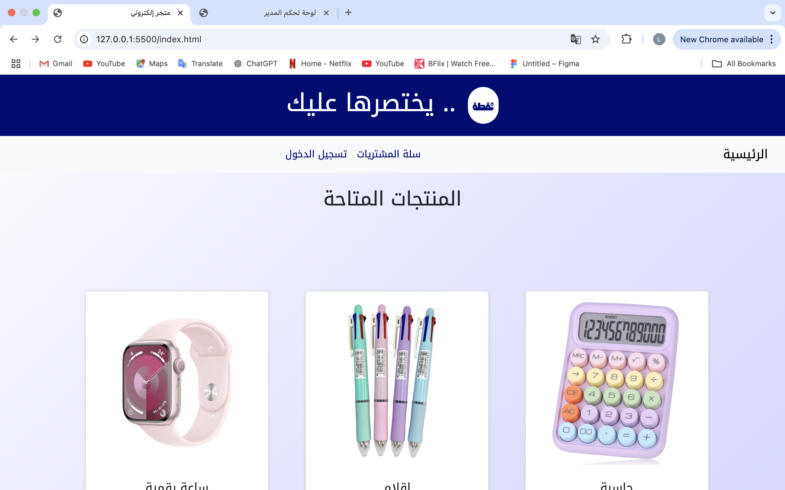
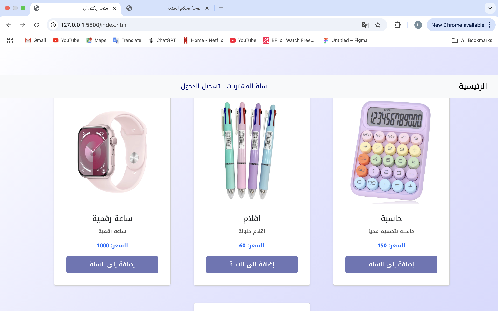
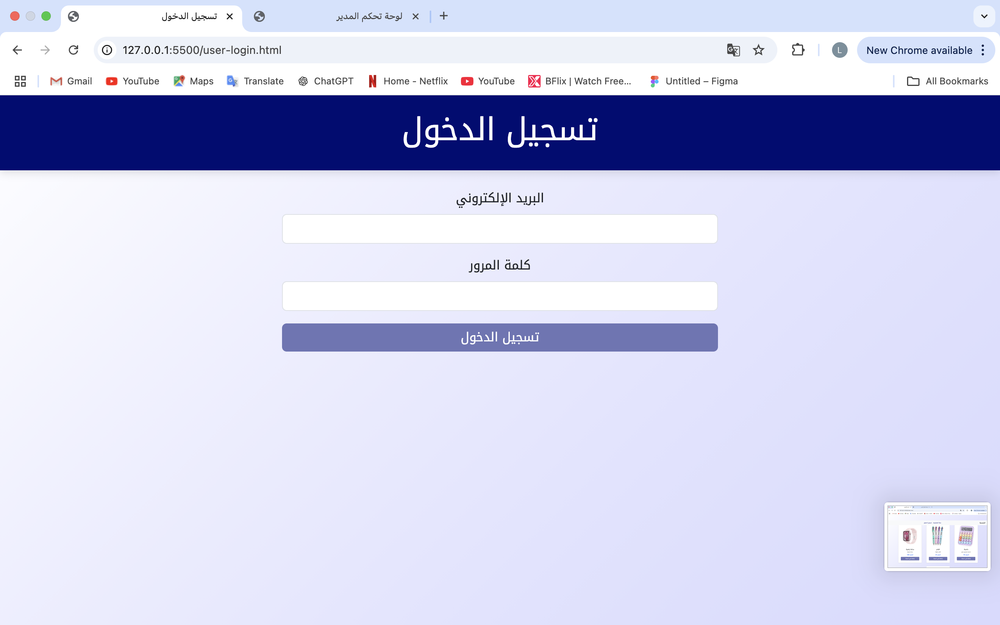
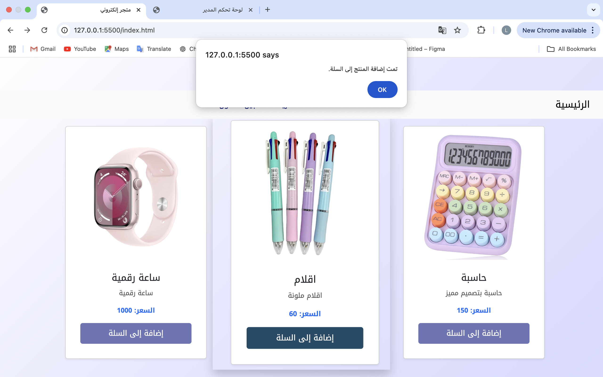
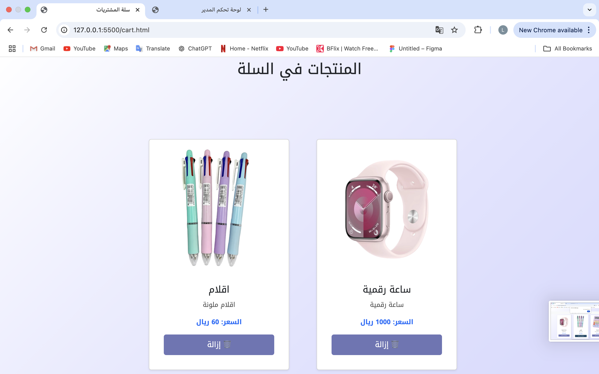
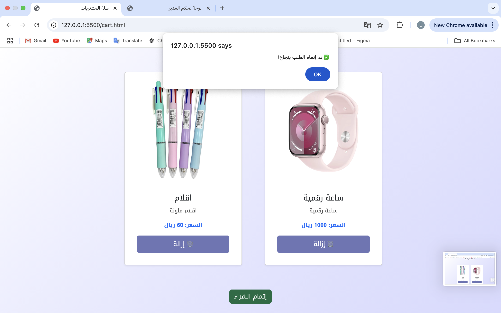
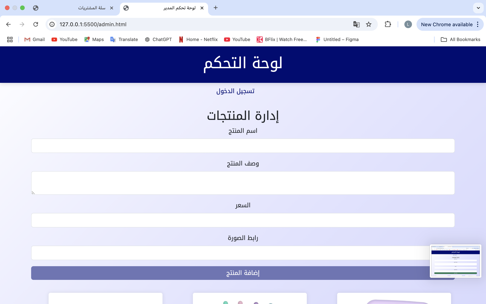
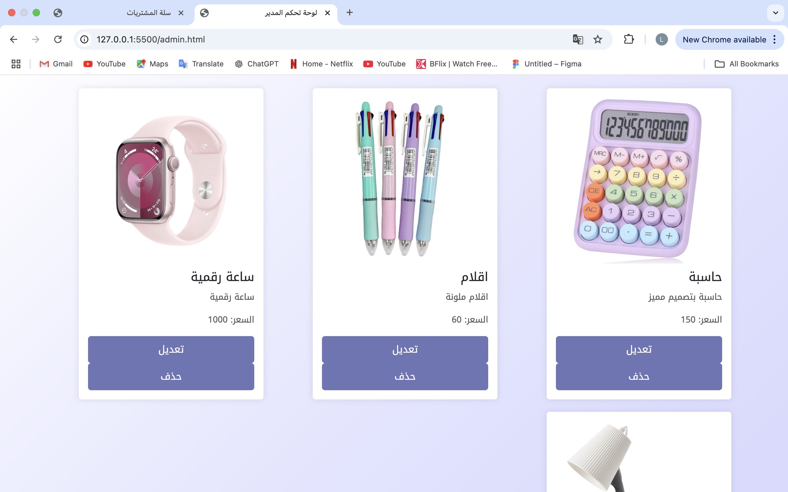
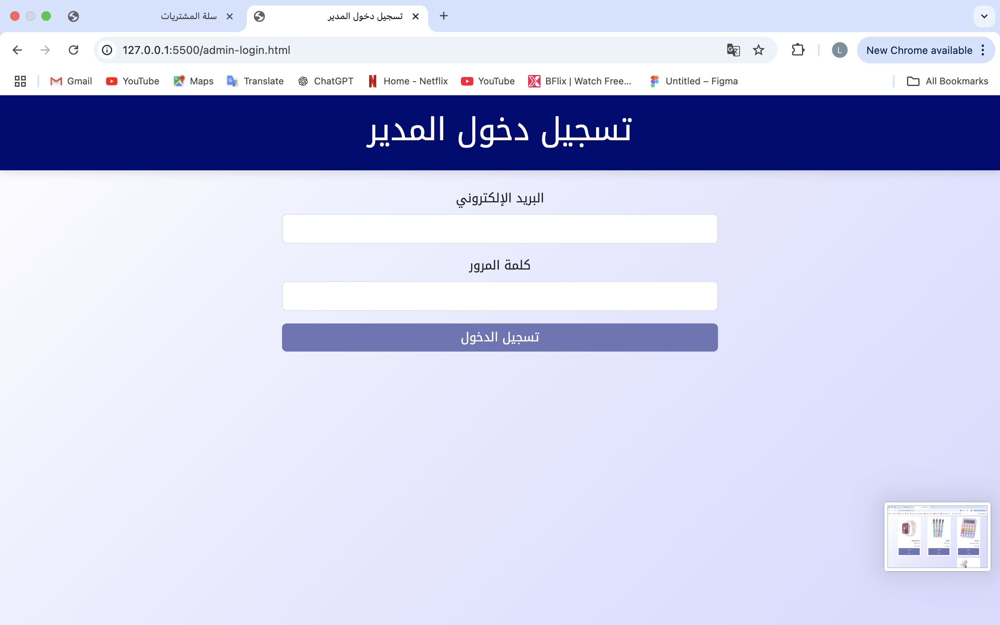

# Online Shop - E-commerce Web Application

## Project Overview
This project is a **full-stack e-commerce web application** developed using **Node.js, Express.js, MongoDB, and Bootstrap**. The platform allows users to **register, log in, browse products, add items to their cart, and place orders**. Additionally, an **admin panel** is provided for managing products.

---

## Features

### User Features
- **User Registration & Login** (with authentication & JWT tokens)
- **Product Browsing & Adding to Cart**
- **Checkout Process & Order Placement**
- **Secure Authentication** using **bcrypt & JWT**

### Admin Features
- **Add, Edit, and Delete Products**
- **View Orders Placed by Users**
- **Admin Authentication** to restrict access
  
### Additional Features
- **Automatic Typing Effect** for the main title.
- **Custom Arabic Font** Uses Google Fonts for improved Arabic text display.

---

## Tech Stack

| **Technology**  | **Usage** |
|---------------|-----------|
| **Frontend** | HTML, CSS, JavaScript, Bootstrap 5 |
| **Backend**  | Node.js, Express.js |
| **Database** | MongoDB + Mongoose ORM |
| **Security** | JWT Authentication, bcrypt password hashing |

---

## Installation Guide

### 1. Clone the Repository
```sh
  git clone https://github.com/your-username/onlineshop.git
  cd onlineshop
```

### 2. Install Dependencies
```sh
  npm install
```

### 3. Configure Environment Variables
Create a `.env` file and add the following:
```sh
MONGO_URI=mongodb://localhost:27017/ecommerce
JWT_SECRET=your_secret_key
PORT=3000
```

### 4. Start the Server
```sh
  node server.js
```

### 5. Open in Browser
- **User Interface:** `http://127.0.0.1:5500/index.html`
- **Admin Panel:** `http://127.0.0.1:5500/admin.html`

---

## Future Work & Enhancements
- **Logout Button** - Implement logout functionality to clear the authentication token.  
- **Search & Filter Products** - Add search bar and filters (e.g., price, category).  
- **Order History Page** - Users should be able to view past orders.  
- **Product Reviews & Ratings** - Allow users to review products.  
- **Wishlist Feature** - Add option to save favorite products.  

---

## ScreenShots

### Home Page


### Products Page


### User Login


### Add to Cart


### Shopping Cart


### Checkout Page


### Admin Panel


### Product Management


### Admin Login


  
---

## License
This project is open-source and available under the MIT License.

---

## Presentation
[Project Presentation](https://www.canva.com/design/DAGdw1KNywk/y_Nt_MnFz4nAwhvA8EORcg/edit?utm_content=DAGdw1KNywk&utm_campaign=designshare&utm_medium=link2&utm_source=sharebutton ). 

---

## Resources
- [Introduction to DOM](https://satr.codes/course/vZLAcAzoFz/view).
- [Introduction to Web CSS](https://satr.codes/course/hNUwyBUKmF/view).
- [Introduction to HTML](https://satr.codes/course/CATspNvVjT/view). 
